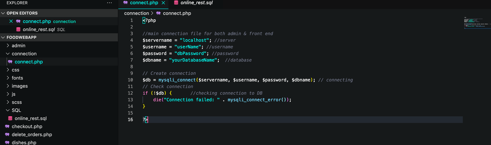
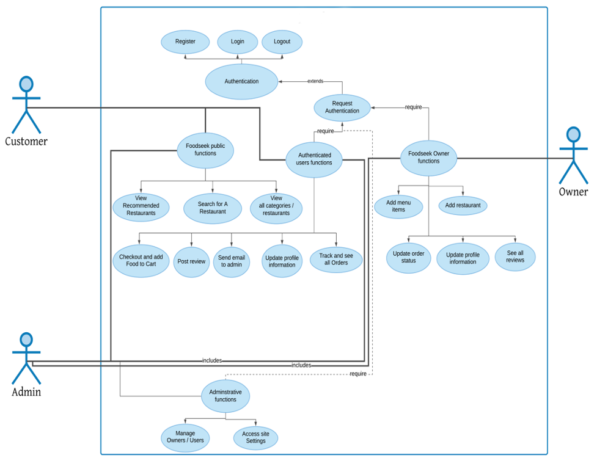

# Web-Based-Online-Food-Ordering-System

Developing a web-based restaurant online ordering system which provides several features that serve targeted users online. The proposed web-based application will provide users/customers to choose any food they like and order it online. Thus, the main target users of the proposed system are the people who keep shifting from cities to another’s and people who is busy and cannot go to eat at restaurants. Also, it will be useful for the students studying in different cities.


### Reqirements
```
Install Apache Server, phpMyAdmin server.
```


### Installation

```
git clone https://github.com/Angellito10/Web-Based-Online-Food-Ordering-System.git
```
## localhost setup

### Configure database connection

Setup your database connection info

```
code editor connection.php 
```



### Create Admin user

Create an admin code using the code snippet below, then create a user with admin privileges.

```
1- code editor SQL/online_rest.sql
2- Go to > admin/index.php
```


#  System Overall Design

### Conceptual diagram  
The conceptual diagram shows the visual representation of the relationships between the system components. A Conceptual diagram is a method used to define, organize and explain the requirements of a system and its conceptual structure.




### Sequence diagram 


### 	Context level DFD


### 	Level-0 DFD


